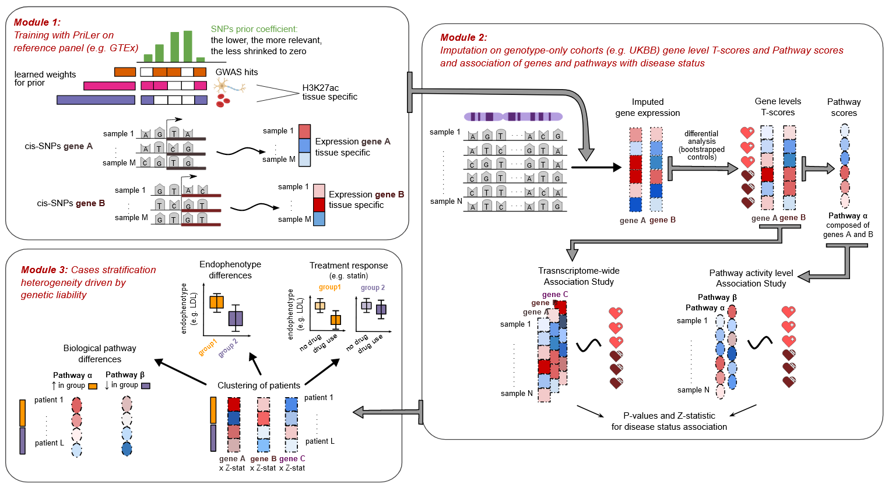

# CASTom-iGEx pipeline: Cases stratification from imputed gene expression
CASTom-iGEx is a multiple step pipeline aiming at converting individual level genotype data into meaningful biological entities such as genes and molecular pathways in order to aggregate single variant effects and detect distinct pathomechanisms in specific patient subgroups. 

## About the project
The framework is divided in 3 separate modules:
1. **Gene-expression model estimation**: based on reference panels with matching RNAseq and genotype data, gene expression activity is estimated based on cis-genetic effects integrating additional biological knowledge on variants. 
2. **Imputation of genes and pathways individual levels on genotype-only cohorts leading to TWAS (transcriptome-wide association) and PALAS (pathway activity level association) studies**: based on the previous module, gene expression is imputed on large-scale cohorts and additionally converted into individual pathway activity levels. Genes and pathways are then tested for association with the disease of interest (TWAS and PALAS). 
3. **Patients stratification** based on imputed gene expression, it quantifies differences in genetic liability distribution
across directly interpretable biological process and pathways as well as clinical and endophenotypic parameters.

## Built with
* R (>= 4.0)
### Required R packages (complete pipeline)
- argparse
- bigmemory
- biomaRt
- circlize
- coin
- cowplot
- data.table
- doParallel
- gep2pep
- ggExtra
- ggplot2
- ggpubr
- ggrepel
- ggsci
- ggsignif
- glmnet
- GO.db
- gridExtra
- igraph
- lattice
- limma
- lme4
- lmtest
- MASS
- Matrix
- matrixStats
- nloptr
- nnet
- pROC
- pheatmap
- pryr
- qvalue
- RColorBrewer
- rlist
- RNOmni
- rstatix
- SparseM
- stringr
- sva
- tidyverse
- umap

## Usage
For details of each module please refer to 
* [Module 1](https://github.com/zillerlab/CASTom-iGEx/tree/master/Software/model_training)
* [Module 2](https://github.com/zillerlab/CASTom-iGEx/tree/master/Software/model_prediction)
* [Module 3](https://github.com/zillerlab/CASTom-iGEx/tree/master/Software/model_clustering)

## References
The pipeline and its application is described in details in:
[Distinct genetic liability profiles define clinically relevant patient strata across common diseases.  Lucia Trastulla, Sylvain Moser, Laura T. Jiménez-Barrón, Till F.M. Andlauer, Moritz von Scheidt, Schizophrenia Working Group of the Psychiatric Genomics Consortium, Monika Budde, Urs Heilbronner, Sergi Papiol, Alexander Teumer, Georg Homuth, Peter Falkai, Henry Völzke, Marcus Dörr, Thomas G. Schulze, Julien Gagneur, Francesco Iorio, Bertram Müller-Myhsok, Heribert Schunkert, Michael J. Ziller. MedRxiv, 2023](https://www.medrxiv.org/content/10.1101/2023.05.10.23289788v1)
